# 5. TravisCI & AWS CodeDeploy로 배포 자동화 구축하기

이번 시간엔 개발한 배포 자동화 환경을 구축하겠습니다.
(모든 코드는 [Github](https://github.com/jojoldu/springboot-webservice/tree/feature/6)에 있습니다.)  


## 6-1. 이전 시간의 문제?

이전까지 개발한 스프링부트 프로젝트를 간단하게나마 EC2에 배포해보았습니다.  
스크립트를 작성해 간편하게 빌드와 배포를 진행한것 같은데 불편한 점을 느끼셨나요?  
현재 방식은 몇가지 문제가 있습니다.

* 수동 Test 
  * 본인이 짠 코드가 다른 개발자의 코드에 영향을 끼치지 않는지 확인하기 위해 전체 테스트를 수행해야만 합니다.
  * 현재 상태에선 항상 개발자가 작업을 진행할때마다 **수동으로 전체 테스트를 수행**해야만 합니다.
* 수동 Build
  * 본인의 PC에서 프로젝트 Build를 수행해야 합니다.
  * Build 수행시간 동안 개발자는 뭘 하고 있을까요?
* 수동 SpringBoot 실행 및 종료
  * 로컬 PC에서 빌드 -> SCP -> 기존에 실행되고 있는 스프링 부트 프로젝트 종료 -> SCP로 전달받은 부트 프로젝트 실행
  * 이걸 하나하나 개발자가 직접 해야만 합니다.

코드 버전 관리를 하는 VCS 시스템에 PUSH가 되면 **자동으로 Test, Build가 수행**되고 Build 결과를 운영 서버에 배포까지 자동으로 진행되는 이 과정을 CI (지속적 통합)이라고 합니다.  
  
단순히 **CI 툴을 도입했다고 해서 CI를 하고 있는 것은 아닙니다**.  
[마틴 파울러의 블로그](https://www.martinfowler.com/articles/originalContinuousIntegration.html)를 가보시면 CI에 대해 다음과 같은 4가지 규칙을 이야기합니다.

* 모든 소스 코드가 살아있고(현재 실행되고) **어느 누구든 현재의 소스를 접근할 수 있는 단일 지점**을 유지할 것
* 빌드 프로세스를 자동화시켜서 **어느 누구든 소스로부터 시스템을 빌드하는 단일 명령어를 사용**할 수 있게 할 것
* **테스팅을 자동화**시켜서 단일 명령어를 통해서 언제든지 시스템에 대한 건전한 테스트 수트를 실핼할 수 있게 할 것
* 누구나 현재 실행 파일을 얻으면 지금까지 최고의 실행파일을 얻었다는 확신을 하게 만들 것

여기서 특히나 중요한 것은 **테스팅 자동화**입니다.  
지속적으로 통합하기 위해선 무엇보다 이 프로젝트가 **완전한 상태임을 보장하기 위해 테스트 코드가 구현**되어 있어야만 합니다.  
(2장과 3장에서 계속 테스트 코드를 작성했던 것을 다시 읽어보시는것도 좋습니다.)  

> Tip)  
테스트코드 작성, TDD에 대해 좀 더 자세히 알고 싶으신 분들은 명품강의로 유명한 [백명석님의 클린코더스 - TDD편](https://www.youtube.com/watch?v=wmHV6L0e1sU&index=7&t=1538s&list=PLagTY0ogyVkIl2kTr08w-4MLGYWJz7lNK)을 꼭 다 보시길 추천합니다.

CI가 어떤건지 조금 감이 오시나요?  
그럼 실제 CI 툴을 하나씩 적용해보겠습니다.

## 6-2. Travis CI 연동하기

[Travis CI](https://travis-ci.org/)는 Github에서 제공하는 무료 CI 서비스입니다.  
젠킨스와 같은 CI 툴도 있지만, 젠킨스는 **설치형**이기 때문에 이를 위한 EC2 인스턴스가 하나더 필요합니다.  
이제 시작하는 서비스에서 배포를 위한 EC2 인스턴스는 부담스럽기 때문에 오픈소스 웹 서비스인 Travis CI를 사용하겠습니다.  
  
### 6-2-1. Travis 웹 서비스 설정

Github 계정으로 [Travis CI](https://travis-ci.org/)에 로그인을 하신뒤, 우측 상단의 계정명 -> Accounts를 클릭합니다.


프로필 페이지로 이동하시면 하단의 Github 저장소 검색창에 프로젝트명을 입력해서 찾아, 좌측의 상태바를 활성화 시킵니다.  


활성화시킨 저장소를 클릭하면 아래와 같이 저장소 빌드 히스토리 페이지로 이동합니다.


Travis CI 웹사이트에서의 설정은 이게 끝입니다.  
상세한 설정은 프로젝트의 yml파일로 진행해야하니, 프로젝트로 돌아가겠습니다.

### 6-2-2. 프로젝트 설정

TravisCI는 상세한 CI 설정은 프로젝트에 존재하는 ```.travis.yml```로 할수있습니다.  
프로젝트에 ```.travis.yml```을 생성후 아래 코드를 추가합니다.

```yaml
language: java
jdk:
  - openjdk8

branches:
  only:
    - master

# Travis CI 서버의 Home
cache:
  directories:
    - '$HOME/.m2/repository'
    - '$HOME/.gradle'

script: "./gradlew clean build"

# CI 실행 완료시 메일로 알람
notifications:
  email:
    recipients:
      - xxx@gmail.com 
```

옵션명만 봐도 충분히 이해하기 쉬운 구조입니다.  

* branches
  * 오직 **master**브랜치에 push될때만 수행됩니다.
* cache
  * Gradle을 통해 의존성을 받게 되면 이를 해당 디렉토리에 캐시하여, 같은 의존성은 다음 배포때부터 다시 받지 않도록 설정합니다.
* script
  * master 브랜치에 PUSH 되었을때 수행하는 명령어입니다.
  * 여기선 프로젝트 내부에 둔 gradlew을 통해 **clean & build 를 수행**합니다.  
* notifications
  * Travis CI 실행 완료시 자동으로 알람이 가도록 설정합니다.
  * Email외에도 Slack이 있으니, 관심있으신 분들은 [링크](http://deptno.github.io/posts/2016/github-travis-ci/)를 참고하여 Slack도 추가하시는걸 추천드립니다.

자 그럼 여기까지 하신뒤, master 브랜치에 commit & push 하신뒤, 좀전의 Travis CI 저장소 페이지를 확인합니다.

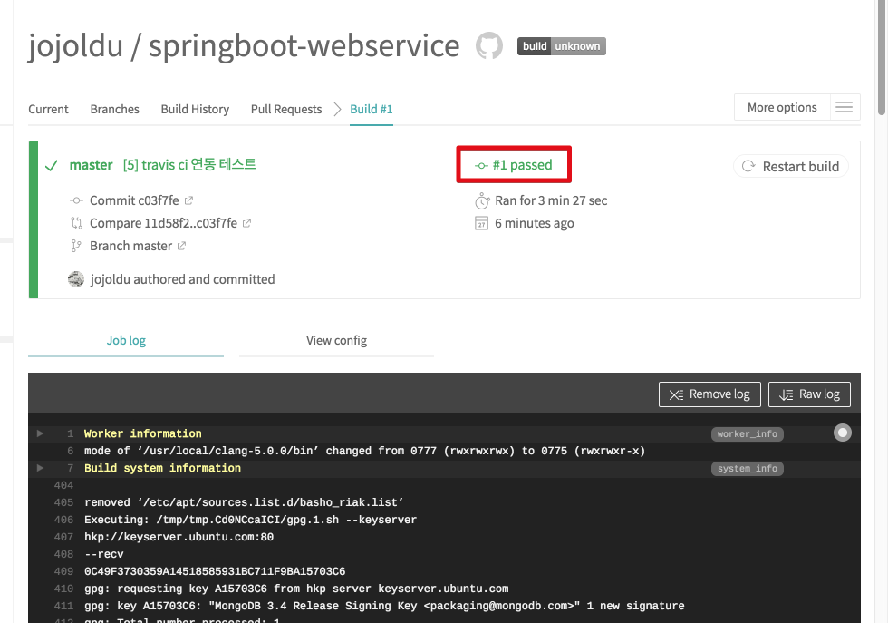

빌드가 성공했습니다!  
빌드가 성공했는걸 확인했으니, 알람도 잘 왔는지```.travis.yml```에 등록한 Email을 확인합니다.

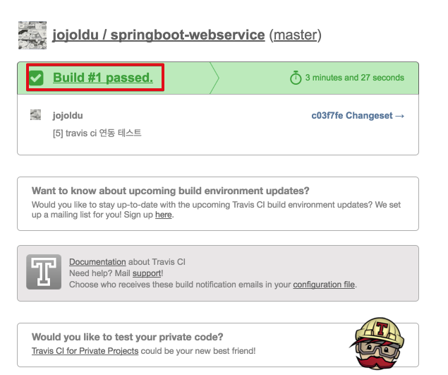

빌드가 성공했는것을 메일로도 잘 전달된것을 확인했습니다!  
여기까지만 하기엔 조금 아쉬우니 다른 오픈소스들처럼 라벨을 추가해보겠습니다.

### 6-2-3. Travis CI 라벨 추가

오픈소스들을 보면 build passing 이란 라벨이 README.md에 표시된것을 종종 볼수있습니다.  
이건 travis ci에서 제공하는 라벨입니다.  
우리의 서비스에도 이와 같은 라벨을 한번 붙여보겠습니다.  
방금전 build 확인을 했던 페이지에서 우측 상단을 보시면 build 라벨을 보실 수 있습니다.  
이걸 클릭하시면 아래와 같은 modal이 등장합니다.

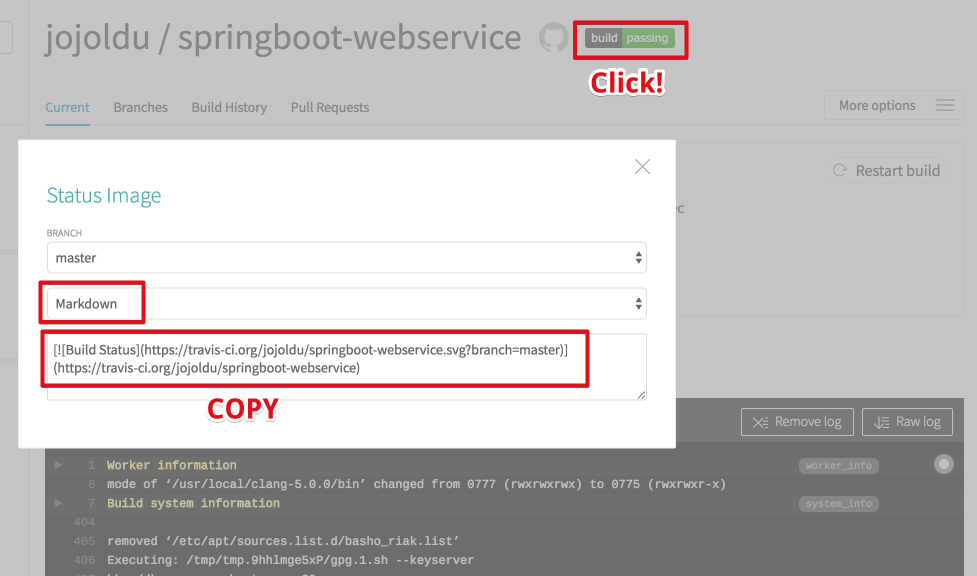

여기서 타입을 Markdown으로 선택하신뒤, 아래에 나오는 코드를 복사하셔서 라벨이 나오길 원하는 위치에 코드를 복사합니다.


자 이렇게 하신뒤 (master브랜치에서) commit & push 하신뒤 Github 페이지로 가보시면!

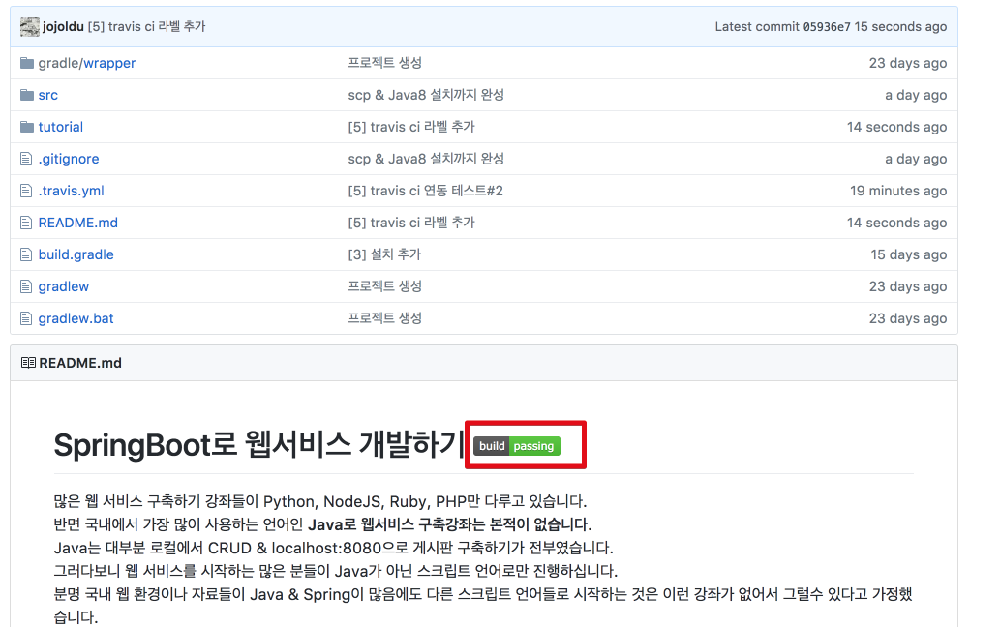

라벨이 붙어있는것을 확인할 수 있습니다!  
  
음.. 근데 뭔가 하나 빠진것 같지 않나요?  
이건 **테스트와 빌드만 자동화** 된것이지, **배포까지 자동화**되진 않았습니다.  
배포가 자동화 되어야만 개발자가 정말 편해지겠죠?  
배포 자동화를 진행하겠습니다.

## 5-3. AWS Code Deploy 연동하기

Travis CI는 결국 CI 툴입니다.  
Test & Build까지는 자동화 시켜주었지만, 빌드된 파일을 원하는 서버로 전달까지 해주진 않습니다.  
**TravisCI로 Build된 파일을 EC2 인스턴스로 전달**하기 위해 AWS CodeDeploy를 사용하겠습니다.  

### 5-3-1. 전체구조

AWS Code Deploy까지 적용되면 전체 구조는 아래와 같습니다.

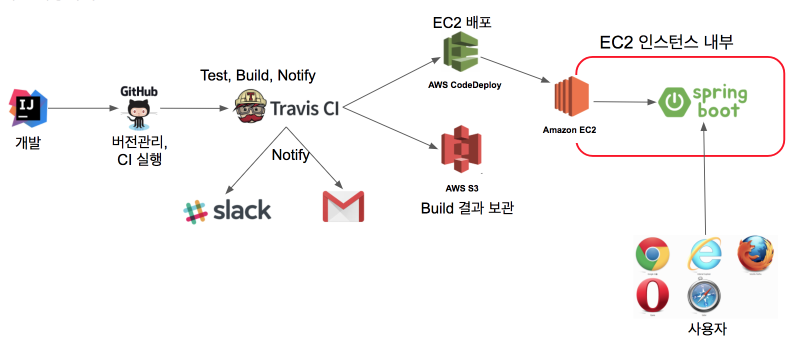

(배포 자동화 구조)  
  
### 5-3-2. AWS Code Deploy 계정 생성

먼저 Travis CI가 사용할 수 있는 **AWS Code Deploy용 계정**을 하나 추가하겠습니다.  
(현재 로그인한 계정은 루트 사용자라 모든 권한을 갖고 있기 때문에 외부에 노출하면 안됩니다.)  
  
AWS의 서비스 검색에서 **IAM**을 선택합니다.  
**사용자** 탭 클릭-> **사용자 추가** 버튼을 클릭 합니다.  

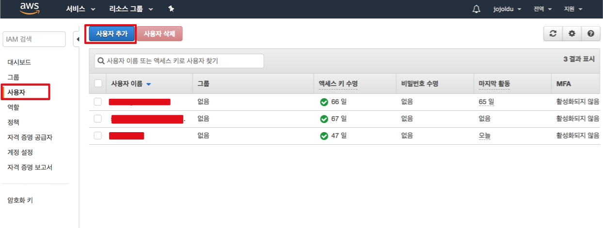

원하는 계정명으로 사용자 이름을 입력하시고, **프로그래밍 방식 엑세스**에 체크합니다.  

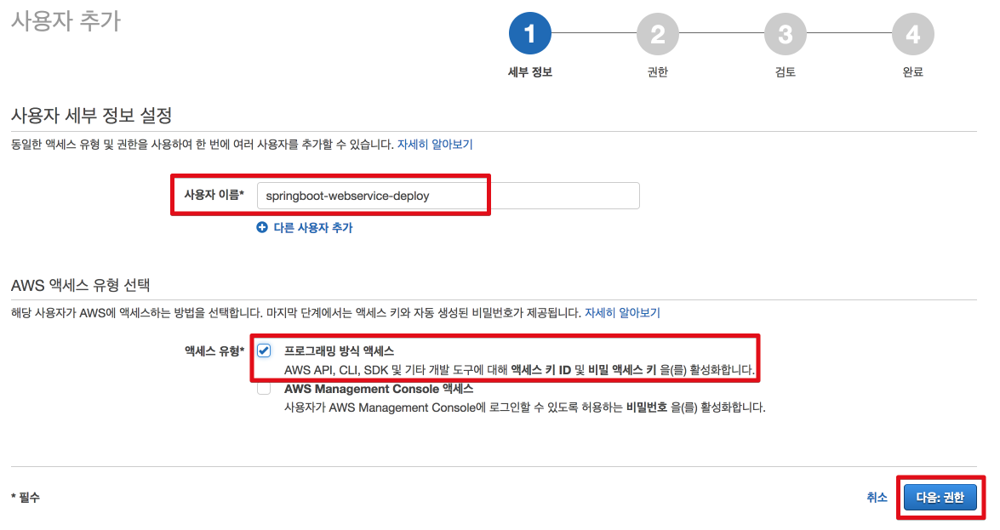

해당 계정이 사용할 수 있는 정책들을 선택하는 페이지입니다.  
저희는 **CodeDeploy**와 **S3** (Build 파일 백업용) 권한만 할당 받겠습니다. 

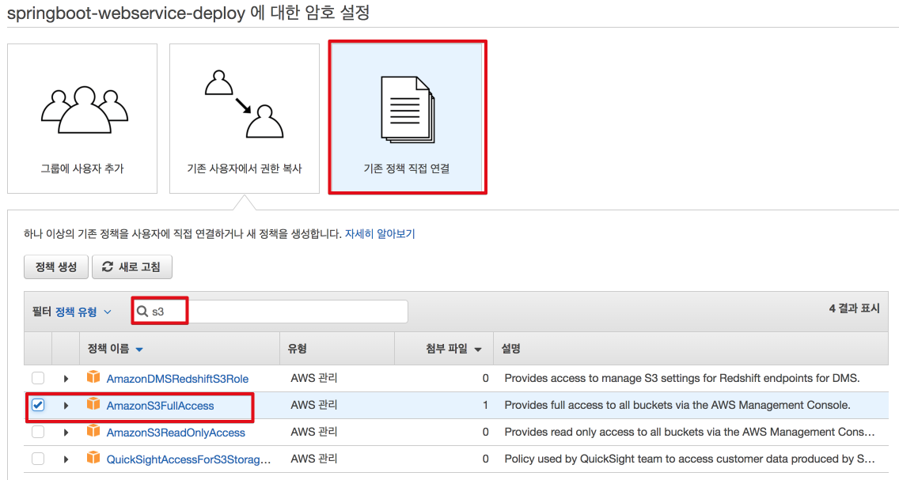

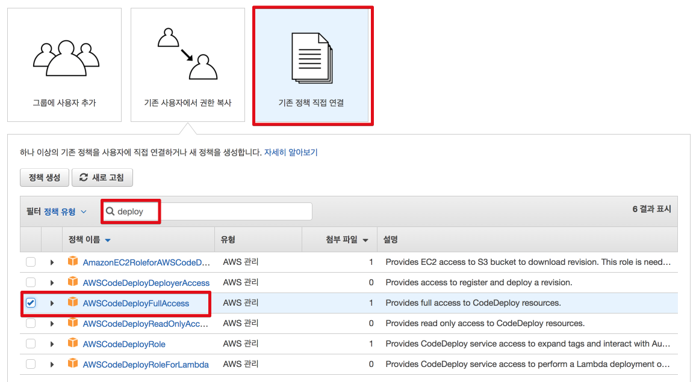

최종적으로 아래와 같이 **AmazonS3FullAccess**, **AWSCodeDeployFullAccess** 정책이 포함되면 됩니다.

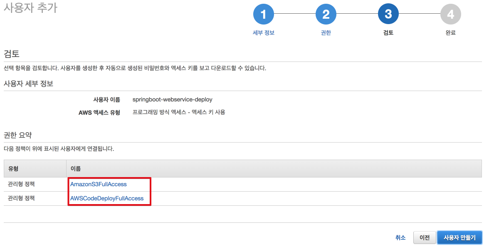

완성 되시면 엑세스키와 비밀(Secret) 키가 생성됩니다.  
좌측의 **.csv 다운로드** 버튼을 클릭해 csv로 키를 저장해놓습니다.  

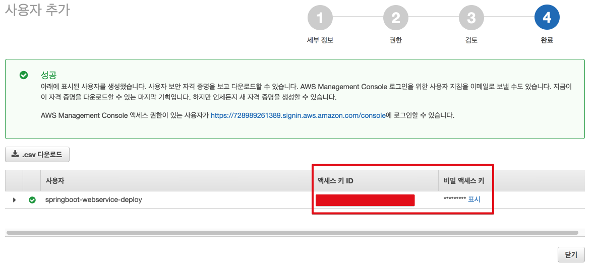

자 이제 Travis CI를 위한 계정이 생성되었습니다.  
이 계정은 앞으로 Travis CI에서 AWS CodeDeploy와 S3를 사용해서 저희의 배포를 진행할 예정입니다!

### 5-3-3. AWS S3 버킷 생성

다음으로 Build 된 jar 파일을 보관할 S3 버킷을 생성하겠습니다.  
  
AWS 관리 페이지에서 서비스 -> S3 검색 -> **버킷 만들기** 버튼을 클릭합니다.  

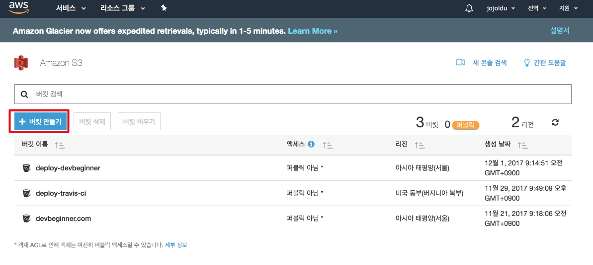

본인이 원하는 버킷 이름과 리전을 선택합니다.

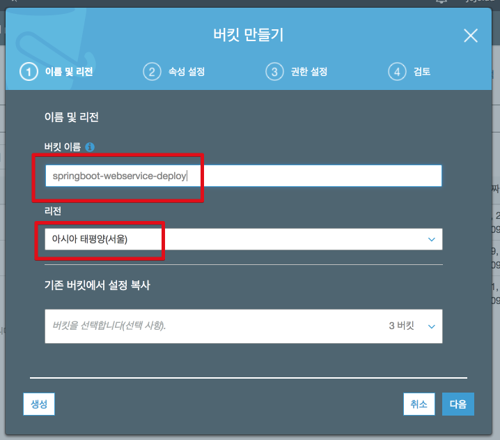

추가 옵션 없이 **다음**을 계속 진행해서 버킷 생성을 완료합니다.  
S3 생성은 이게 끝입니다.  
간단하죠?  

### 5-3-4. IAM Role 추가

이번에는 사용자를 대신에 access key & secret key를 사용해 원하는 기능을 진행하게할 AWS Role (이하 역할)을 생성하겠습니다.
EC2와 CodeDeploy를 위한 역할을 생성합니다.  

> Tip)  
역할(Role)에 대해 좀 더 자세한 설명은 [AWS 공식 가이드](https://docs.aws.amazon.com/ko_kr/IAM/latest/UserGuide/id_roles_create_for-service.html)를 참고하시면 좋습니다.

**5-3-2**때와 마찬가지로 **IAM**을 검색해서 이동합니다.  
좌측 화면의 **역할**을 클릭합니다.

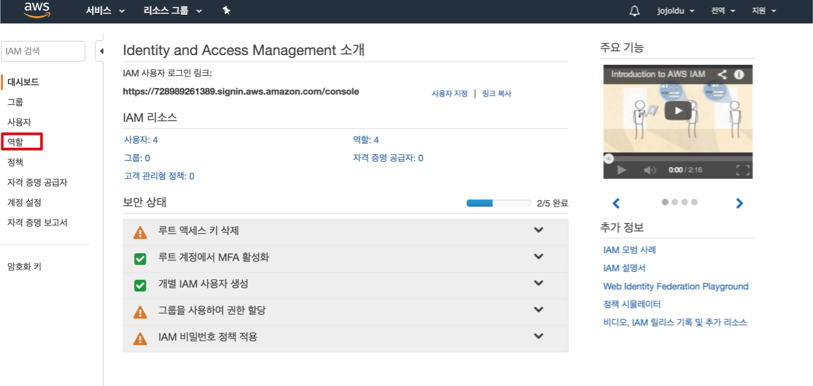

**역할 만들기** 버튼을 클릭합니다.

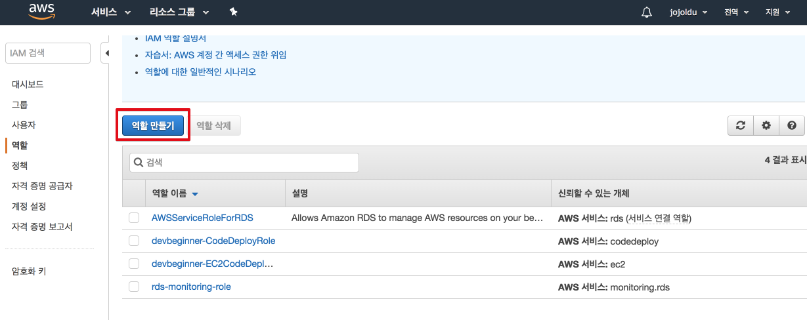

**AWS 서비스** -> EC2 -> 하단의 **사용사례선택**에서 EC2를 선택하신 후, **다음:권한** 버튼을 클릭합니다.

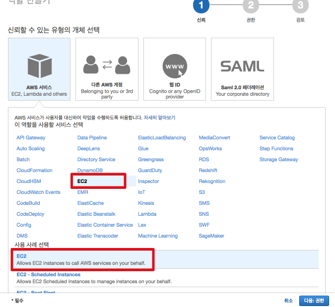

많은 정책중, **AmazonEC2RoleforAWSCodeDeploy**를 검색하셔서 체크합니다.

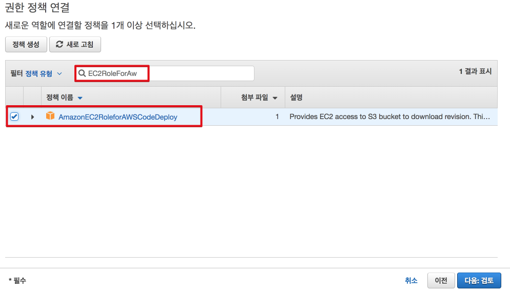

본인이 원하시는 역할 이름을 선택합니다.  
보통은 서비스명-EC2CodeDeployRole 으로 짓습니다.

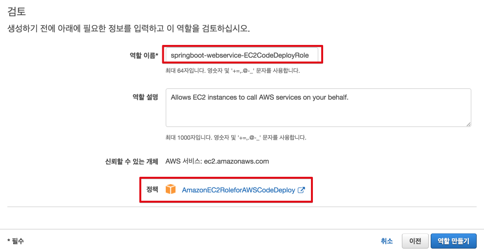

자 그리고 여기서 한가지 Role을 추가합니다.  
CodeDeploy가 사용자를 대신해 배포를 진행하는 Role입니다.  
똑같이 IAM -> 역할 -> 역할만들기로 생성합니다.  

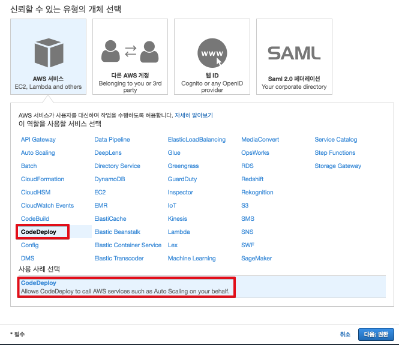

CodeDeploy Role은 하나밖에 없어서 별다른 체크 없이 바로 다음으로 넘어갑니다.

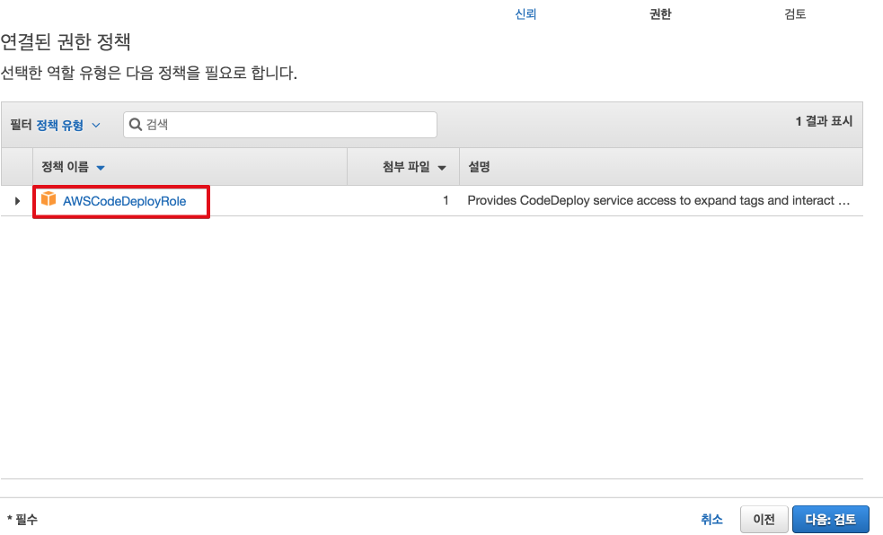

역할 이름은 서비스명-CodeDeployRole로 지었습니다.

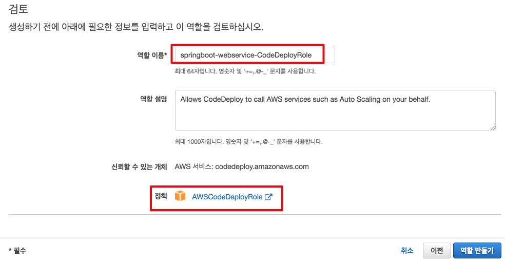

자 그럼 생성한 이 역할(Role)들을 AWS 서비스에 하나씩 할당해보겠습니다.

### 5-3-5. EC2에 Code Deploy Role 추가

서비스 -> EC2로 이동하셔서 저희가 생성했던 EC2 인스턴스를 우클릭합니다.  
**IAM 역할 연결/바꾸기**를 선택합니다.

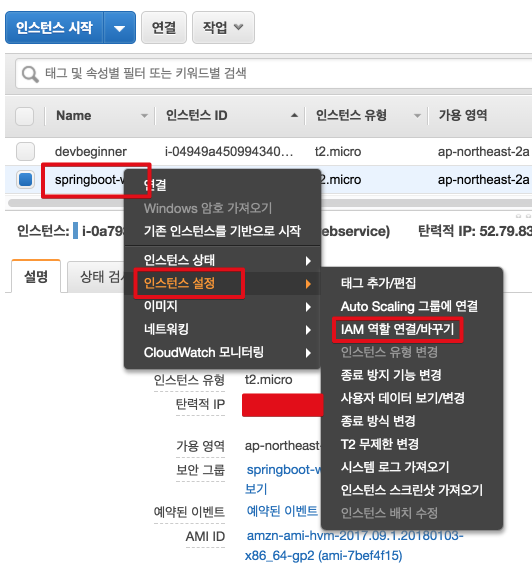

그리고 좀전에 생성한 EC2CodeDeployRole을 선택합니다.


자 이제 우리의 EC2 인스턴스에 Code Deploy Agent를 설치하러 가보겠습니다.

### 5-3-6. EC2에 CodeDeploy Agent 설치

EC2만 있다고 CodeDeploy 알아서 척척 수행될순 없습니다.  

```bash
sudo aws configure
```

```bash
aws s3 cp s3://aws-codedeploy-ap-northeast-2/latest/install . --region ap-northeast-2
```

```bash
chmod +x ./install
```

```bash
sed -i "s/sleep(.*)/sleep(10)/" install
```

```bash
sudo ./install auto
sudo service codedeploy-agent start
```

```bash
sudo service codedeploy-agent status
```

EC2 인스턴스가 부팅되면 자동으로 codedeploy가 실행될 수 있도록 쉘 스크립트 파일을 하나 생성하겠습니다.  

```bash
sudo vim /etc/init.d/codedeploy-startup.sh
```

스크립트 파일에 아래의 내용을 추가합니다.

```bash
#!/bin/bash

echo 'Starting codedeploy-agent'
sudo service codedeploy-agent start
```


## 참고

* [TeamApex Wiki](https://github.com/airavata-courses/TeamApex/wiki/Milestone-5-Guide-to-Setting-Up-Amazon's-CodeDeploy-Travis-Integration)

* [Travis CI 설정 Sample](https://github.com/travis-ci/cat-party)
